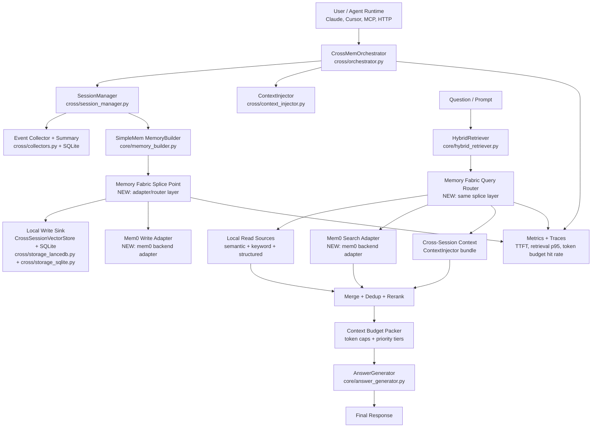

# SimpleMem Memory Fabric Diagram

This diagram shows the integration shape with a **careful splice point** (adapter/router layer), not blind wiring.

## Splice Contract (tap-in point)

- **Input (write):** normalized `MemoryEntry` list from `MemoryBuilder`.
- **Output (write):** fan-out to local store and optional Mem0 store.
- **Input (read):** query + retrieval intent from `HybridRetriever`.
- **Output (read):** unified candidate memories with provenance + scores.

## Why this is a careful splice

- Existing SimpleMem modules remain primary; no core replacement.
- New layer is isolated and reversible.
- Local path remains authoritative fallback if Mem0 is down.
- All merges are explicit: dedupe, scoring normalization, provenance tracking.

